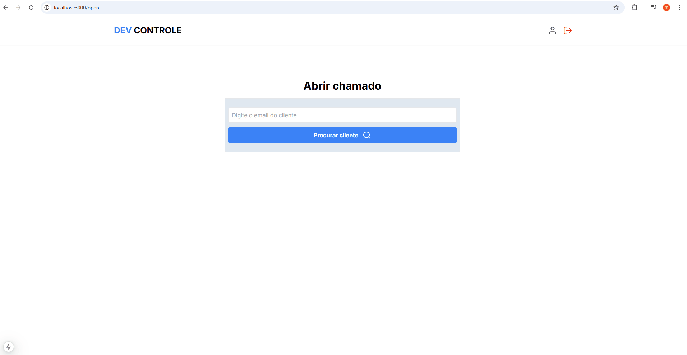

# Projeto DevControle
Estrutura do Projeto DevControle, projeto estudado no curso NextJs do zero ao avançado, ministrado pelo professor Matheus Fraga. <br>
O projeto consiste em um sistema de chamados, na qual , é necessário realizar login através de uma conta google. e registrar os seus chamados, além de cadastrar seus clientes. 

<br>
<br>

# Login Utilizando conta no Google
O projeto faz login através de uam conta google, não necessitando a realização de um cadastro com um email que não seja do google.

<br>

<br>
<br>

# Cadastro de clientes
 <br>

Os Clientes são registrados pelos usuários, desta maneira podemos abrir os chamados para clientes cadastrados com seus devidos contratados 
<br>
<br>

<br>
<br>

# Cadastro de chamados
<br>
Os Chamados seram registrados pelos clientes, podendo resgitra-los pelos clientes cadastrados e tendo uma breve descrição sobre o ocorrido, podemos ver detalhes do chamado e finalizado quando ele for resolvido.
<br>
<br>

<br>
<br>

# Cadastro de chamados sem Login
<br>
Os Chamados podem ser registrados sem o login, cadastrando apenas pelo email do cliente, mostrando para o contratado que o cliente registrou um chamado 
<br>
<br>

<br>
<br>

# Tecnologias Utilizadas &#128218;

- React
- Typescript
- NextJs
- Tailwind CSS
- Prisma
- Axios 

<br>

# Como Utilizar

```
Clone o projeto:

git clone <url>

Execute a aplicação com o seguinte comando: 

npm run dev

ou 

yarn dev

Abra [http://localhost:3000](http://localhost:3000) com seu navegador para ver o resultado.

Você pode começar a editar a página modificando `app/page.tsx`. A página é atualizada automaticamente conforme você edita o arquivo.

Este projeto usa [`next/font`](https://nextjs.org/docs/basic-features/font-optimization) para otimizar e carregar automaticamente o Inter, uma fonte personalizada do Google.
